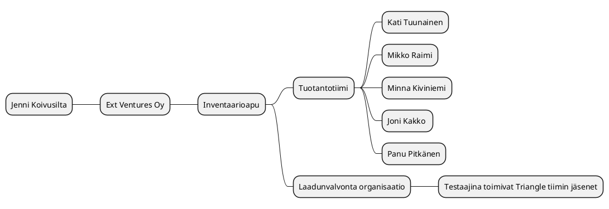

# Inventaariotyökalun projektisuunnitelma

|  |  |
|:-:|:-:|
| Dokumentti | Inventaariotyökalun projektisuunnitelma |
| Laatija: | Kati Tuunainen |
| Versio: | 1.0 |
| Päivämäärä: | 19.09.2022 |
| Muokattu | 12.10.2022 |
| Tila | kesken |


## 1. Toimeksianto 

## 1.1 Tausta ja lähtökohdat

>Olin yhteydessä Ext Ventures Oy:n Jenni Koivusiltaan ja kysyin olisiko heillä tarvetta Low Codella, eli tässä tapauksessa AppGyverilla, toteutettavalle sovellukselle. Löysimme useamman kuin yhden kohteen, johon sovellus toisi helpotuksen. Kehitettäväksi kohteeksi valikoitui John Smith Rock festivaaleilla tapahtuvan fanituotemyynnin inventaariota helpottava sovellus. Kehitämme tiimin kanssa sovelluksen, johon saa keskitetysti kaikki inventaarion laskentatulokset samaan paikkaan.
>Projekti toteutetaan Jyväskylän ammattikorkeakoulun informaatioteknologian instituutin järjestämän Ohjelmistoalan osaaja ‑opintojakson puitteissa. 

## 1.2 Tavoitteet ja tehtävät

> Ajatus inventaarioapu sovelluksesta lähti siitä, että festareilla tapahtuva tuotteiden laskenta, eli inventaario ennen ja jälkeen myyntien, on hektistä ja kuormittavaa. Halusimme löytää ratkaisun tähän tilanteeseen. Aiemmin tuotteet eri esiintyjiltä on laskettu lapuille. Projektin tavoitteena onkin pyrkiä pääsemään eroon irrallaan pyörivistä lappusista, joihin on aiemmin merkattu inventaariolaskentojen tulokset. Ensimmäisenä tehtävänämme on selvittää inventaarion kulkua ja Ext Ventures Oy:n toimintatapoja. Sen jälkeen selvitämme mitä kaikkia ominaisuuksia he haluavat tulevaan sovellukseen. Tämän jälkeen pohdimme tiimin kanssa yksityiskohtia ja toteutustapoja. Sovelluksen toteutamme AppGyverilla ja käytämme Miroa suunnittelussa. Dokumentaatio tehdään GitLabiin. Rinnakkaistiimin kanssa sunnittelimme testaavamme tuotteemme ristiin. Tavoitteenamme on saada Ext Venturesille sovellus, josta on apua inventaarioissa ja että he saisivat lapun pyörityksen jätettyä kokonaan pois. 

> Tähän voi liittää lähteeksi vaatimusmäärittelyn sisältöä

## 1.3 Rajaus ja liittymät

> Keksimme asiakkaan kanssa muitakin kehittämisen kohteita heidän toiminnassaan, mutta rajasimme ne tällä erää pois tästä projektista. Koska asiakkaallamme on alkamassa kiireinen ajanjakso, saattaa se merkittävästi rajoittaa projektin etenemistä. Tästä syystä olemme olleet tiiviisti asiakkaaseen yhteydessä, jotta saamme kaikki mahdolliset projektin aloittamiseen kriittisesti liittyvät tiedot. Myös projektijohtajan, Kati Tuunaisen, aloitus toisessa työharjoittelussa saattaa vaikuttaa tiimin tuloksiin. Suunnitteilla olevaan inventaarioapu sovellukseen saatetaan tulevaisuudessa rakentaa lisää ominaisuuksia asiakkaan saatua tuotteen käyttöönsä.

## 1.4 Oikeudet

> Asiakkaan edustajan kanssa on sovittu, että heillä on täysi käyttö- ja muokkausoikeus sovellukseen liitettyjen ominaisuuksien puitteissa sekä lähdekoodi jää kehittäjätiimin haltuun.

## 1.5 Termit ja määritelmät

>Tässä kappaleessa esitellään projektisuunnitelmassa esiintyvät määritelmät, termit ja lyhenteet. 

## 1.6 Projektiin liittyvät haasteet

>Haasteita projektiin tuo mm. inhimilliset tekijät, kuten sairastuminen, äkilliset kiireelliset tapaukset lähipiirissä jne. Tapahtuessaan pahimmillaan keskeyttää projektin hetkellisesti, lievimmillään hidastaa työn etenemistä. Olemme varautuneet siten, että kunkin tiimin jäsenen jäädessä syystä tai toisesta pois kokonaan tai väliaikaisesti, muut tiimin jäsenet yhdessä tekevät jääneet työt. Kukin jäsen kirjaa tekemisiään  ja aikomisiaan ylös, jotta muiden on helppo ottaa tilanne haltuun. Haasteena projektissa on myös sen rajaaminen. Kaikkea haluttua toiminnallisuutta emme kerkeä annetun ajan puitteissa rakentamaan. Myös projektin jäsenten kokemattomuus on haasteena, koska kaikki opiskelemme vasta alaa ja käytettäviä työkaluja.

## 2. Projektiorganisaatio

## 2.1 Organisaation esittely

> Linkki projektiryhmän jäsenten esittelyyn.

* [Kurkkaa tästä!](https://fi-a2022-ttc2070.pages.labranet.jamk.fi/ht1-AC8409-/inventaarioapu-2022/10-Projektihallinta/esittely/)

**Mukana myös:**

| Nimi | Organisaatio | Vastuu |
|:-:|:-:|:-:|
| Jenni Koivusilta | Ext Ventures Oy | Tilaajan edustaja |
| Jouni Huotari | Jamk | Pääopettaja |


**Projektiorganisaation rakenne MindMap-muodossa**



## 2.2 Vastuut ja päätöksentekoprosessi

>Johtoryhmän vastuulla on päättää mitä vaatimuksia sovelluksella on. Projektipäällikkö valmistelee ja esittää johtoryhmän päätettäväksi muutokset, joita työryhmässä on ehdotettu. Projektiryhmä vastaa kunkin tehtävän valmistumisesta ajallaan. 

>”Projektiryhmä suorittaa johtoryhmän projektille asettamat tehtävät käytettävissä olevien resurssien puitteissa.”

>”Johtoryhmän muodostavat siihen valitut projektiryhmän ja toimeksiantajan edustajat, tässä tapauksessa Kati Tuunainen, Joni Kakko sekä Jenni Koivusilta. Johtoryhmän kokouksiin >voidaan tarvittaessa kutsua myös muita henkilöitä, esim. asiantuntijoita.” 

>Asiakkaana olevan Ext Ventures Oy:n yhteyshenkilönä toimii Jenni Koivusilta, joka toimii johtoryhmässä asiakkaan edustajana. Jenni Koivusillan sähköpostiosoite on jenni@ext.fi ja puhelinnumero on +358 40 163 9771. Ulkopuolisena konsulttina toimii pääopettaja Jouni Huotari.

## 2.3. Projektin vaiheet ja taloudelliset tavoitteet

## 2.4. Laadun varmistus

>Laadun varmistus tapahtuu jatkuvasti ryhmän sisällä keskustellen. **menetelmät, standardit, hyväksymismenettely, muutosten hallinta, dokumentointi, katselmoinnit, riskien hallinta, muut täydentävät suunnitelmat**

## 2.5. Tiedonvälitys ja projektin etenemisen seuranta

>Projekti aloitettiin 12.9.2022 muodostamalla projektiryhmä. Työskentelemme pääsääntöisesti etänä ja käytämme yhteydenpitoon Teams- kanavaa. Olemme sopineet, että joka aamu pidämme pienen palaverin, missä käydään nopeasti läpi edistyminen ja mahdolliset pulmat. Kerran viikossa pidämme pidemmän palaverin, jossa käydään läpi jokaisen henkilön tulevan viikon työtavoitteet. Palaverit pidämme myös Teamsin välityksellä.

## 2.6. Projektin päättyminen

>Projekti on tarkoitus saada päätökseen viimeistään 2.12.2022. Kati opastaa sovelluksen käytön asiakkaalle samalla viikolla ja loppuraportti on valmis ja projekti virallisesti päätetty 2.12.2022 mennessä. Aineisto taltioidaan projektiin osallistuneiden omiin tiedostoihin. **YLLÄPITO?** 

## 3. Projektin ajalliset tavoitteet	

## 3.1 Osittaminen ja vaiheistus

>Projektin etenemistä voidaan kuvata ns. GANTT-kaaviolla. Sen avulla voidaan esittää eri vaiheiden eteneminen aikajanalla, samalla voidaan osoittaa projektin eri vaiheisiin liittyvät kriittiset pisteet / etapit. Ohjelmistoprojekteissa karkea etenemisjärjestystä voi kuvata ohjelmistojen [SDLC](https://en.wikipedia.org/wiki/Systems_development_life_cycle )-mallilla.
Tästä voidaan nostaa esiin muutama oleellisia vaiheita kuten:

* Määrittely
* Suunnittelu
* Toteutus
* Testaus
* Luovutus

**Esitetään vaiheet yksinkertaisen GANTT diagrammin avulla**

```plantuml
Project starts the 2022-9-12
[Projekti aktiivinen] Starts 2022-5-15 and ends 2022-12-2 
[Määrittely vaihe] Starts 2022-9-12 and ends 2022-9-16
[Suunittelu] Starts 2022-9-19 and ends 2022-9-30
[Toteutus+suunnittelu] Starts 2022-10-1 and ends 2022-10-31
[Testaus+korjaus] Starts 2022-11-1 and ends 2022-11-11
[Hyväksyntätestaus] Starts 2022-11-14 and ends 2022-11-25
[Luovutus] Starts 2022-11-28 and ends 2022-12-1
```


Päivitä linkit omaan projektiin liittyviksi!

* [Etappi 0](https://gitlab.labranet.jamk.fi/jamkit/project-templates/opf-core-template-v2/-/milestones/2)
* [Etappi 1](https://gitlab.labranet.jamk.fi/jamkit/project-templates/opf-core-template-v2/-/milestones/3)
* [Etappi 2](https://gitlab.labranet.jamk.fi/jamkit/project-templates/opf-core-template-v2/-/milestones/4)
* [Etappi 3](https://gitlab.labranet.jamk.fi/jamkit/project-templates/opf-core-template-v2/-/milestones/5)
* [Etappi 4](https://gitlab.labranet.jamk.fi/jamkit/project-templates/opf-core-template-v2/-/milestones/6)

>Projektin osittamisella tarkoitetaan projektin jakamista selkeisiin osakokonaisuuksiin ja niitä vastaaviin toteutuskokonaisuuksiin (osaprojekteihin, vaiheisiin, tehtäväkokonaisuuksiin ja tehtäviin). >Tutkimus- ja kehitysprojektien etenemiselle on tyypillistä lopputuloksen muodostuminen ja tavoitteen tarkentuminen vaihe vaiheelta. Projektin osituksen tulee perustua tähän lähtökohtaan (koskee myös >IT-instituutin opiskelijaprojekteja). 
>Projektin elinkaari voidaan jakaa erityyppisiin vaiheisiin. Kussakin vaiheessa tuotetaan määrätyt tuotteet, kuten selvitys, suunnitelmat, prototyyppi, laite jne. Kunkin vaiheen loppuun sovitaan arviointi, hyväksyntä tai katselmointi. Ohjelmistoprojekti jakautuu tyypillisesti seitsemään vaiheeseen: perustaminen, esitutkimus, analyysi, suunnittelu, toteutus, testaus ja lopettaminen. Joskus esitutkimus on oma projektinsa, joskus analyysi sisällytetään suunnitteluun jne. Testaus ei välttämättä ole oma vaiheensa, vaan se sisältyy kaikkiin vaiheisiin. Usein edetään inkrementaalisesti eli ensin suunnitellaan ja toteutetaan yksi asia kokonaisuudessaan ennen kuin edetään seuraavaan asiakokonaisuuteen. Ei ole yhtä ainutta ”oikeaa” vaihejakoa, mutta jos toimeksiantajalla on oma menetelmänsä ja siihen liittyvät mallipohjat, niin opiskelijaprojekteissa käytetään ensisijaisesti niitä. Yhä useammin käytetään ketterää sovelluskehitystä eli ohjelmisto tehdään 1-4 viikon sprinteissä.

>Mitä tavoitteita  / vaiheita projekti sisältää? (Lyhyt kuvaus kustakin)> <Mitä tuloksia kustakin vaiheesta syntyy? >

Seuraavassa käydään jokainen vaihe, niiden vaatimat aikaresurssit ja tulokset läpi lyhyesti. Vaiheet ja niiden tehtävät kuvataan tarkemmin vaihesuunnitelmissa. Parhaillaan meneillään olevasta vaiheesta tulee olla tiedossa tarkasti kuka tekee ja kuinka paljon työtä tämän vaiheen tehtävien suorittamiseksi. Myöhempien vaiheiden työmääräarviot voidaan esittää alkuvaiheessa karkealla tasolla, jota sitten projektin edetessä tarkennetaan yksityiskohtaiselle tasolle. Tämä tapahtuu jokaisen vaiheen lopussa, jolloin suunnitellaan tarkemmin seuraava vaihe.

Huom.: Seuraavassa on esitetty käynnistys- ja lopetusvaiheet. Kaikista projektin vaiheista, niiden kestoista ja työmääristä laaditaan myös nk. Gantt-kaavio (liitteenä), jossa näkyy myös vaiheiden väliset riippuvuudet ja tärkeimmät etapit (esim. johtoryhmän kokouspäivämäärät).

>Projektin eteneminen kannataa jakaa ns. tavoitteisiin/etappeihin. Näiden tehtävän on osoittaa ajanhetkeä, jollon jokin oleellinen projektin vaihe on tarkoitus saavuttaa. Projektille määritellyt etapit voidaan linkittää dokumentaation kanssa yhteen käyttäen apuna Issue/Milestone linkkejä avulla. *Katso esimerkit alla*


* [Etappi 0](https://gitlab.labranet.jamk.fi/jamkit/project-templates/fi-opf-2022-core-template-v2/-/milestones/1)

>esim. ryhmän webbisivut, tutustutaan tarkemmin toimeksiantoon, aloitetaan kohdealueeseen perehtyminen ja laaditaan projektisuunnitelma yhteistyössä toimeksiantajan edustajien kanssa. 
>Projektin käynnistämiseen kuuluu olennaisesti projektisuunnittelu ja suunnitteludokumenttien laatiminen sekä yhteydenpitokäytänteiden luominen toimeksiantajayrityksen kanssa. Vaiheen aikana tehdään
>Etappiin mennessä muodostetaan johtoryhmä, pidetään johtoryhmän kokous sekä allekirjoitetaan projektisopimus.

* [Etappi Z](https://gitlab.labranet.jamk.fi/jamkit/project-templates/fi-opf-2022-core-template-v2/-/milestones/3)

>Esimerkkinä Etappi Z , jossa tavoitteet on asetettu ennakkon esimerkkeinä: projektisuunnitelman hyväksyminen, tavoitteiden tarkistaminen

* [Etappi X](https://gitlab.labranet.jamk.fi/jamkit/project-templates/fi-opf-2022-core-template-v2/-/milestones)

>Sovittu etappi X, jossa suoritettaa esimerkisi katselmointi ja esitetään tilanneraportti

* [Etappi Y](https://gitlab.labranet.jamk.fi/jamkit/project-templates/fi-opf-2022-core-template-v2/-/milestones)


* [Etappi Z](https://gitlab.labranet.jamk.fi/jamkit/project-templates/fi-opf-2022-core-template-v2/-/milestones)

>”Lopettamisvaihe sisältää projektin päättämiseen liittyvät toimenpiteet. Vaiheen aikana projektiryhmä laatii projektin loppuraportin ja esityksen johtoryhmälle. Vaiheen aikana luovutetaan projektin tulos toimeksiantajalle, pidetään viimeinen johtoryhmän kokous viikolla X sekä puretaan projektin organisaatio. Lopettamisvaiheen tuloksena on projektin loppuraportti.”

## 3.2 Projektin alustavat kustannusarvio


Kustannusarvion esittäminen taulukon avulla: 


## 4. Laadunvarmistus

>Projektissa sovellettavat työmenetelmät, välineet, ohjeet ja standardit

>Tässä kappaleessa luetellaan kaikki käytettävät menetelmät, työkalut ja standardit versionumeroineen. Usein toimeksiantajalla on jokin menetelmä, jota projektiryhmän olisi syytä noudattaa. Toimeksiantaja voi määrittää myös noudatettavat dokumenttien ulkoasustandardit. Muussa tapauksessa projektiryhmä räätälöi IT-instituutin tarjoamista mallipohjista itselleen soveltuvan ja toimeksiantajan hyväksymän mallin.

>Opintojakso asettaa siis tietyt vaatimukset projektin seurantatyökaluille ja raportoinnille, jotka tulee ottaa huomioon. Opintojaksolla ei kuitenkaan pakoteta tiettyä tapaa käyttää työkaluja, joten niiden käytöstä on syytä tehdä suunnitelma tähän kohtaan.

>Projektin tiedon- ja versionhallinnan perusteet tulee selvittää, jotta kaikki projektin sidosryhmät tietävät dokumenttien uusimpien versioiden sijainnin. Projektisuunnitelmasta ja kaikista muistakin projektin keskeisistä dokumenteista tulee useita versioita, joihin pitää lisätä versiohistoria, jotta projektin kehityksen seuraaminen jälkikäteen on mahdollista. Mikäli jokin yksittäinen laite tai ohjelmisto nousee projektin toteutuksen kannalta kriittiseen asemaan, on tälle hyvä nimetä vastuuhenkilö, joka tuntee ko. laitteen tai ohjelmiston ryhmästä parhaiten. Ohessa on lista asioista, jotka kannattaa suunnitella ja dokumentoida: 

## 4.1 Väli- ja lopputulosten hyväksymismenettely

>Tähän kirjataan se hyväksymismenettely, mikä projektissa on sovittu.

## 4.2 Muutosten hallinta

>Kuvataan muutosten hallintaproseduuri projektinkäytäntöihin tai projektin tuloksiin liittyvien muutosten osalta.

## 4.3 Dokumentointi

>Kirjataan minne dokumentit tallennetaan/arkistoidaan, miten ne jaetaan ja kuka on vastuussa eri dokumenteista.

## 4.4 Riskien hallinta

>Listataan riskit, arvioidaan niiden vakavuus ja todennäköisyys ja koetetaan miettiä toimenpiteet kuinka vakavimmat/todennäköisimmät riskit voitaisiin ehkäistä jo ennalta. Lisäksi olisi hyvä olla suunnitelma kuinka toimitaan, jos riski toteutuu.
>Kirjataan alla olevaan taulukkoon projektiin kohdistuvat riskit ja pidetään niitä yllä tarpeen mukaan. Jokaiselle riskille annetaan yksilöllinen tunniste esim. RIS007, koska tämä helpottaa niiden käsittelyä eri tilanteissa.

Liitä seuraava osio tähän mukaan: [Riskienhallintataulukko](riskitaulukko.md)

## 4.5 Katselmointikäytäntö

>Luetellaan ja alustavasti aikataulutetaan projektin tuloskatselmukset laaditun toteutussuunnitelman pohjalta. Esitetään luettelomaisesti, mitä katselmuksia pidetään, alustava ajankohta, käsiteltävät asiat, osallistujat sekä käytännöt katselmointimateriaalin toimittamisesta (mitä, milloin, miten).

## 4.6 Projektisuunnitelmaa täydentävät suunnitelmat

>Tässä kohdassa mainitaan, mitä täydentäviä suunnitelmia on käytettävissä tai aiotaan projektin kuluessa laatia (esim. viestintä-, riskienhallinta-, testaus- ja käyttöönottosuunnitelma).

* [Projektisopimus](..//10-Projektinhallinta/projektisuunnitelma.md)
* [Vaatimusmäärittely](../20-Vaatimustenhallinta/vaatimusmaarittely.md)
* [Julkaisusuunnitelma](../40-Julkaisusuunnittelu/julkaisusuunnitelma.md)
* [Yleistestisuunnitelma](../40-Julkaisusuunnittelu/julkaisusuunnitelma.md)
* [Viestintäsuunnitelma](..//10-Projektinhallinta/viestintasuunnitelma.md)
* [Riskihallintasuunnitelma](../10-Projektinhallinta/riskihallinta-suunnitelma.md)
* [Muu annettu dokumentaatio]()


## 4.7 Suunnitelmien tarkistus- ja päivitysajankohdat 

>Projektisuunnitelman avulla reagoidaan poikkeamiin ja ympäristömuutoksiin, joten sitä päivitetään projektin aikana. Tähän kohtaan kirjataan ne ajankohdat, jolloin suunnitelman ajantasaisuus ainakin on tarkistettava.

## 4.8 Projektin keskeyttämiskriteerit

Oikeaoppiseen projektisuunnitelmaan kuuluu myös projektin keskeyttämiskriteerit. Näitä ei kuitenkaan opiskelijaprojekteissa käytetä, koska projekteissa käytetään tietty tuntimäärä tuloksen tekoon ja tulos luovutetaan sellaisena, kun se opintojakson päättyessä on. Projektiryhmä tekee kuitenkin jatkokehityssuunnitelman, josta mahdollinen uusi projekti jatkaa.

## 5. Tiedonvälitys ja projektin etenemisen seuranta (viestintäsuunnitelma)

## 5.1 Viestintäsuunnitelma

>Viestintäsuunnitelman tarkoituksena on määritellä X projektin yhteydessä käytetyt viestintämenetelmät ja kanavat. Selkeällä ja yhdenmukaisella viestinnällä varmistetaan >informaation kulku ja vaikutetaan projektin laatutavoitteiden toteutumiseen. Suunnitelma voidaan laatia osana projektisuunnitelmaa tai siihen voidaan viitata omana [alasivunaan](../10-Projektihallinta/viestintasuunnitelma.md)

>Listaa projektissa sovitut työtilat ja viestintävälineet, palaverikäytäntö ja yhteydenpito, raportointi ja tiedotus.

## 6. Projektin päättyminen

## 6.1 Lopputuotteen luovutus, käyttöönotto

>Projektin lopputuote tulee myös dokumentoida järkevällä tasolla. Osana lopputuotetta saattaa olla asiakkaalle tarjottavaa käyttöönottokoulutusta ja mahdollisesti asennus- tai käyttöönotto­palvelua. Mikäli koulutuksen rooli projektin kannalta on huomattava (esimerkiksi ohjelmiston käyttäjät eivät ole olleet mukana projektissa ja eivät tiedä miten järjestelmä toimii) tulee projektisuunnitelmaan liittää suunnitelma asiakkaalle tarjottavasta koulutuksesta. Lisäksi jos on tarpeen, tulee projektisuunnitelmaan liittää myös asennussuunnitelma ja käyttöönottosuunnitelma.

## 6.2 Projektin tuottaman aineiston taltiointi, arkistointi ja säilytysaika

>”Projektiryhmien dokumentaatiosta jäävä osa tallennetaan X-järjestelmään” 
>Toimeksiantajan kanssa tulee tarvittaessa voida sopia, mitkä dokumentit voidaan jättää opiksi seuraaville projekteille. 
>Tyypillisesti eri suunnitelmat ja loppuraportti sopivin osin ovat tällaisia dokumentteja. 

## 6.3 Projektin virallinen päättäminen

>On tärkeää määritellä milloin, mihin tai miten projekti päättyy. Projektin päätös voi olla tietty päivämäärä, tietty tuotteen valmiusaste, tietty työtuntimäärä, tietty kulutettu rahasumma, kun asiakas ottaa tuotteen käyttöön, takuuaika on umpeutunut tai kun asiakas hyväksyy tuotteen.

>”Projekti päättyy p.k.vvvv, jolloin projektisopimuksen voimassaoloaika päättyy.”

## 6.4 Lopetustilaisuus

>Yleensä projektit päätetään yhteiseen päätösseminaariin. Tähän kirjataan osallistujat ja ajankohta. 

* Saunailta :)?


## 6.5 Projektin loppuraportti

>Projektin loppuraportti laaditaan viimeiseen johtoryhmän kokoukseen mennessä.

